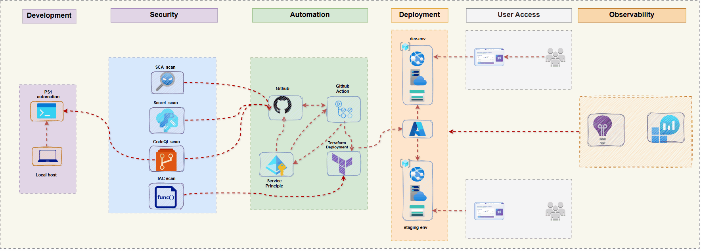

# 🔐 GlobalSend DevSecOps Pipeline

Project 2 builds directly on **Project 1: GlobalSend DevOps Pipeline**, extending the multi-environment delivery workflow with **full DevSecOps enforcement**.

Where Project 1 focused on automation, consistency, and zero-downtime deployments, Project 2 adds **security gates, and compliance checks** that run automatically on every pull request.

**Goal:** Only secure, compliant, and policy-approved code is allowed to deploy.

---

## 🚀 Overview
This security-first CI/CD pipeline validates code, dependencies, secrets, and infrastructure before deployment. All checks must pass before merging, ensuring a secure and reliable delivery process.

**Key Outcomes:**

- Enforced SAST, SCA, secrets, and IaC scanning  
- Predictable, reproducible multi-environment deployments via Terraform  
- Zero-downtime production releases with Blue-Green deployment  
- Passwordless authentication via GitHub OIDC → Azure  
- Branch protections and required checks for full DevSecOps enforcement  

---

## 🛡 Security Architecture
Security is applied **before any deployment**.

### Security Gates (Pull Request Stage)

| Category            | Tools                     | Purpose                          |
|---------------------|---------------------------|----------------------------------|
| SAST                | CodeQL, Semgrep           | Block insecure code patterns     |
| SCA                 | Trivy, Dependabot         | Detect vulnerable dependencies   |
| Secrets             | GitLeaks                  | Prevent credential leakage       |
| IaC Security        | Checkov, TFSec            | Enforce Terraform compliance     |

> **No merge unless all scans pass.**

---

## 🏗 Architecture

**End-to-End Flow:**  
`Dev → GitHub → DevSecOps Pipeline → Security Gates → Terraform → Azure → Users`

### Architecture Diagram

---

## ⚡ Key Components

| Component           | Technology / Service                | Purpose                                           |
|--------------------|-------------------------------------|---------------------------------------------------|
| Frontend App       | HTML5, CSS3, JS                     | Money transfer UI with live calculator            |
| Infrastructure     | Terraform                           | Azure resource provisioning                       |
| Hosting            | Azure App Service                   | Web application hosting                           |
| Storage            | Azure Storage Account               | ZIP package deployment + Terraform backend        |
| CI/CD              | GitHub Actions                      | Automated, security-gated pipeline                |
| Authentication     | GitHub OIDC, Service Principals     | Passwordless dev auth, secure staging/prod auth   |
| Deployment Strategy| Blue-Green                          | Zero-downtime production releases                 |
| Automation         | PowerShell                          | Validation, branch promotion, deployment          |
| Security Scanning  | CodeQL, Semgrep, Trivy, Dependabot, GitLeaks, Checkov, TFSec, Azure Policy | SAST, SCA, secrets, IaC compliance, policy enforcement |
| Observability  | Azure Monitor, App Insights   | Metrics, logs, performance insights               |

---

## 🔧 Multi-Environment Strategy

| Environment | Branch     | Deployment Trigger          |
|-------------|------------|-----------------------------|
| Development | `dev`      | Push to dev branch          |
| Staging     | `staging`  | Merge dev → staging         |
| Production  | `main`     | Blue-Green deployment       |

**Pipeline Features:**

- Branch-based environment detection  
- OIDC authentication for development  
- Service Principal authentication for staging & production  
- Automated Terraform plan & apply  
- Smoke tests + Blue-Green swap for production  
- Full DevSecOps security gates on every PR  

---

## 🗂 Project Structure

| Folder | Purpose |
|--------|---------|
| /app | Frontend code (HTML, CSS, JS) |
| /assets | Images and icons |
| /scripts | PowerShell automation & deployment |
| /terraform | Infrastructure as Code & modules |
| /.github/workflows | CI/CD pipeline YAMLs |
| README.md | Project overview |

---

## 🛡 Security & Best Practices

- **OIDC Authentication:** Passwordless Azure login for development  
- **Service Principals:** Secure credentials for staging & production  
- **Environment Isolation:** Separate Azure subscriptions per environment  
- **IaC Security:** Checkov + TFSec scanning on every PR  
- **Branch Protections:** Required checks enforce DevSecOps  
- **Zero Static Credentials:** No secrets stored in GitHub  
- **Blue-Green:** Safe, reversible production deployments  

---

## 📬 Contact
For questions about this DevSecOps pipeline or cloud architecture best practices, reach out anytime.

*Last Updated: February 2026 | GlobalSend Money Transfer Application*

---

## 📜 License
MIT License